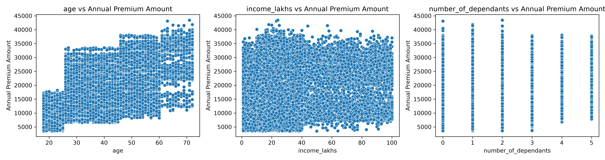
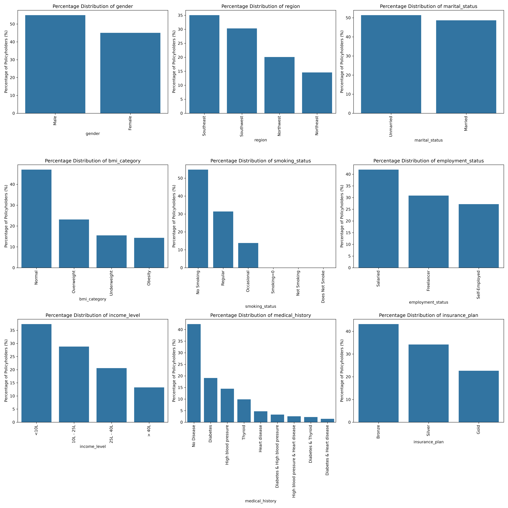
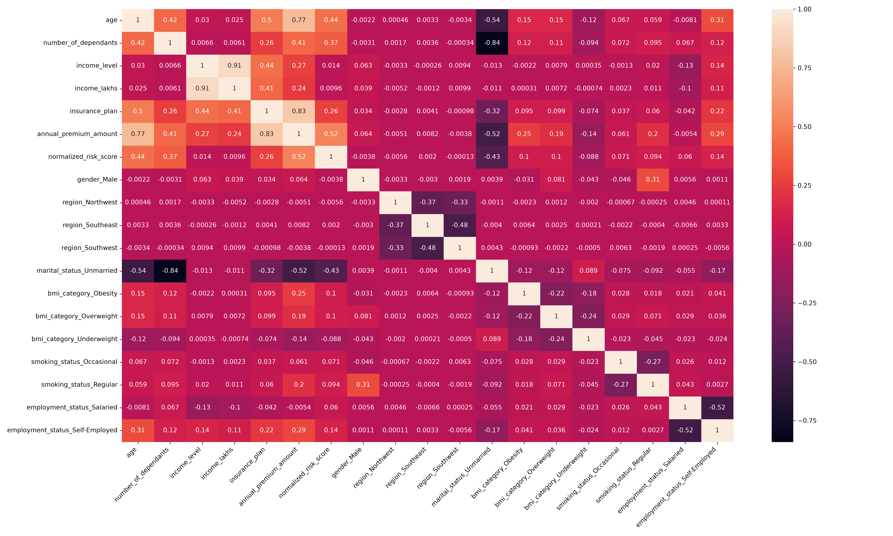
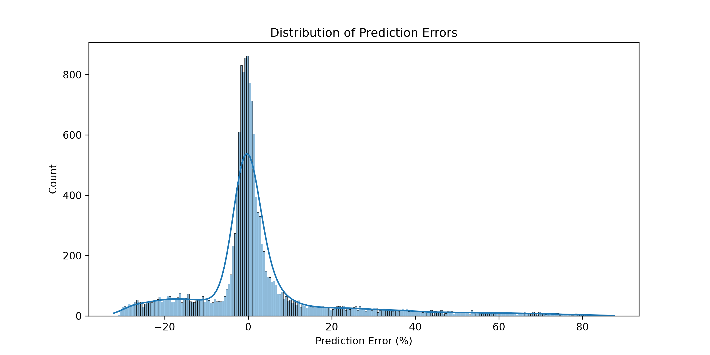

## Project Overview

This project focuses on predicting an individual's annual health insurance premium using machine learning. The model uses demographic, financial, lifestyle, and health-related factors to estimate the premium for a customer.

The project follows a complete machine learning workflow, including data collection, data cleaning and exploratory data analysis, feature engineering, model training and tuning, error analysis, model segmentation, retraining, and deployment.

The final solution uses separate machine learning models for different age segments and is deployed as an interactive Streamlit application that allows users to enter customer information and receive a predicted annual health insurance premium.

## Business Problem

Health insurance companies need to determine an appropriate annual premium for each customer based on their demographic, financial, lifestyle, and health-related characteristics.

Manually estimating premiums can be difficult because multiple factors can influence the cost of insuring an individual. Underpricing can increase financial risk for the insurer, while overpricing can make insurance less attractive to customers.

The objective of this project is to develop a machine learning model that can predict an individual's annual health insurance premium based on factors such as age, income, medical history, smoking status, BMI, genetic risk, number of dependants, and insurance plan.

## Dataset

The dataset contains customer-level information used to predict annual health insurance premiums.

### Target Variable

- `annual_premium_amount` — The annual health insurance premium amount.

### Features

The dataset includes customer demographic, financial, lifestyle, and health-related information, including:

- Age
- Gender
- Number of Dependants
- Income
- Marital Status
- BMI Category
- Smoking Status
- Employment Status
- Region
- Medical History
- Insurance Plan
- Genetic Risk

The genetic risk feature was introduced later during the model improvement process to provide additional information for the underperforming young-age segment.

## Data Cleaning & EDA

Before training the models, the dataset was cleaned and explored to identify data quality issues and understand the factors associated with annual health insurance premiums.

### Data Cleaning

Missing values were identified and handled to ensure a complete dataset for model development.

The analysis also revealed extreme values in `age` and `income_lakhs`. These outliers were treated to prevent unusually large observations from disproportionately influencing the regression models.

Inconsistent values in `smoking_status` were also cleaned to ensure that the categorical feature represented the underlying customer groups consistently.

### Exploratory Data Analysis

The numerical feature distributions revealed the overall spread of customer characteristics and helped identify skewed variables and unusual observations that required attention during data cleaning.

The relationship between **age, income, number of dependants, and annual premium** was then examined to understand how changes in these customer characteristics were associated with premium amounts.

The categorical analysis provided an overview of the customer population across factors such as smoking status, employment status, BMI category, and insurance plan, helping establish the composition of the dataset before model training.

Finally, the correlation analysis was used to identify relationships between the numerical features and the target variable, providing an initial indication of which variables could contribute to premium prediction and informing the subsequent feature engineering process.

## Feature Engineering

After cleaning the data, I created and selected features that could help the model predict health insurance premiums more accurately.

### Calculating Risk Score

Medical history was converted into a numerical risk score. Different medical conditions were given different risk values, and the scores were combined when a customer had more than one condition.

This gave the model a simple way to understand the overall health risk of each customer.

### Encoding Categorical Features

Some features contained categories instead of numbers, so they needed to be converted into numerical values.

For `insurance_plan`, the plans were encoded as:

- Bronze = 1
- Silver = 2
- Gold = 3

`income_level` was also converted into numerical values.

For other categorical features, I used one-hot encoding so that the model could use them without creating an incorrect order between categories.

### Feature Selection

I selected the features that were useful for predicting the annual premium and removed unnecessary or redundant features.

### Checking for Multicollinearity

I used Variance Inflation Factor (VIF) to check whether some features were too closely related to each other.

This helped reduce unnecessary overlap between features before training the models.

## Model Training & Evaluation

I trained and compared three regression models to find a model that could predict annual health insurance premiums well.

### Models Used

- Linear Regression
- Ridge Regression
- XGBoost Regression

Linear Regression was used as a baseline model, while Ridge Regression helped handle possible multicollinearity. XGBoost was tested to capture more complex relationships in the data.

### Model Evaluation

The models were evaluated using:

- R2 Score
- RMSE

The R2 score showed how well the model explained the variation in premium amounts, while RMSE showed the average size of the prediction error.

XGBoost gave the best overall performance, with an R2 score of approximately **0.98** on the test data.

### Hyperparameter Tuning

I also tuned the XGBoost model to find better hyperparameter values and improve its performance.

Feature importance from XGBoost was also checked to understand which features had the most influence on the predicted premium.

## Error Analysis & Model Segmentation

After training the initial model, I checked where its predictions were going wrong instead of looking only at the overall R2 score.

Around **30% of the test predictions had an error of more than 10%**. 

When I looked at these high-error predictions, I found that most of them were from younger customers.

Further analysis showed that the extreme-error group was heavily concentrated around customers aged **25 or below**.

This suggested that the model was not learning the younger customer segment as well as the rest of the dataset.

### Model Segmentation

To handle this difference, I divided the dataset into two age groups:

- **Young:** Age ≤ 25
- **Rest:** Age > 25

I then trained separate models for these two groups so that each model could learn the patterns specific to its age segment.

The young segment still had relatively high prediction errors, which led to the next step: requesting additional data. Genetic risk data was then provided, and the models were retrained.

## Model Retraining

The error analysis showed that the young-age segment needed additional information to improve its predictions.

To address this, **Genetic Risk** was added as a new feature. The models were then retrained using the additional information for both age segments.

For the **Young segment (Age ≤ 25)**, the retrained Linear Regression model achieved an R2 score of approximately **0.989**, which was a significant improvement over the earlier model.

The Rest segment (Age > 25) was also retrained using the additional genetic risk information.

The final models were saved along with their corresponding scalers and later used in the Streamlit application for making predictions.

## Streamlit Application

The final machine learning models were deployed as an interactive Streamlit application.

The application allows users to enter customer information such as age, income, dependants, medical history, smoking status, BMI, insurance plan, and genetic risk.

Based on the customer's age, the application automatically selects the appropriate age-segment model and scaler to generate the predicted annual health insurance premium.

The application provides a simple interface where users can enter their details and get a premium prediction instantly.

## Technologies Used

- Python
- Pandas
- NumPy
- Scikit-learn
- XGBoost
- Matplotlib
- Seaborn
- Jupyter Notebook
- Streamlit
- Joblib
- Git & GitHub